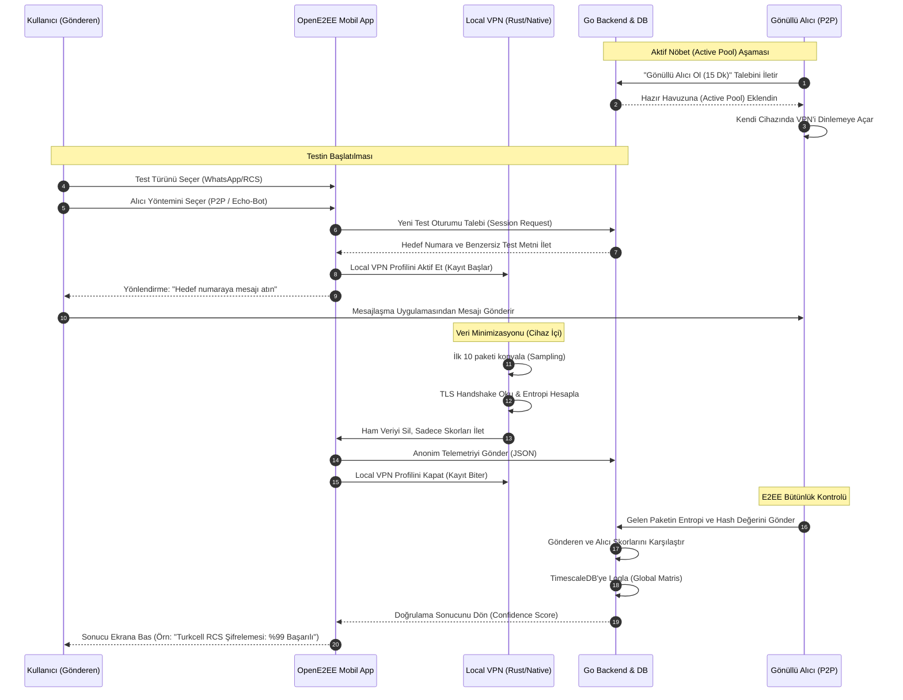

# OpenE2EE - Görev Odaklı Test Akış Şeması (Flowchart)

Aşağıdaki şema, bir kullanıcının uygulamayı açıp testi başlatmasından sonucun gösterilmesine kadar geçen teknik ve kullanıcı akışını göstermektedir.

